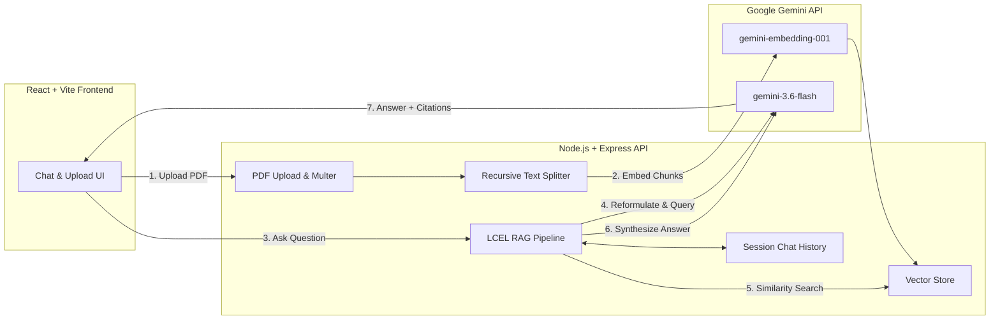

# 🤖 DocChat — Conversational RAG Document Assistant

DocChat is a full-stack **Retrieval-Augmented Generation (RAG)** application that allows users to upload PDF documents and interact with them in real-time through an intuitive, conversational chat interface. Powered by **Google Gemini**, **LangChain**, and a modern **React + Vite** frontend.

---

## ✨ Features

- 📄 **PDF Ingestion & Parsing**: Upload single or multiple PDF documents with automated text extraction and recursive chunking.
- 🧠 **Vector Embeddings & Semantic Search**: Generates dense vector embeddings using Google's `gemini-embedding-001` model and performs cosine similarity search.
- 🔄 **Conversational Memory & Query Rephrasing**: Maintains multi-turn conversation history and automatically reformulates follow-up questions into standalone queries using LangChain Expression Language (LCEL).
- 🎯 **Grounded Answers with Citations**: Strictly constrained prompting prevents hallucinations and attributes answers directly to source documents.
- ⚡ **Sleek React 19 Frontend**: Minimalist, responsive UI featuring drag-and-drop file upload, indexing progress status, suggestion chips, and smooth auto-scrolling chat.
- 🚀 **Cloud Deployment Ready**: Out-of-the-box configuration for deploying the frontend on **Netlify** and backend on **Render**.

---

## 🏗️ Architecture



---

## 🛠️ Tech Stack

### Frontend
- **Framework**: [React 19](https://react.dev/) + [Vite](https://vitejs.dev/)
- **HTTP Client**: [Axios](https://axios-http.com/)
- **Styling**: Vanilla CSS (CSS variables, glassmorphism, responsive flex/grid layouts)
- **Deployment**: [Netlify](https://www.netlify.com/) (`netlify.toml`)

### Backend
- **Runtime**: [Node.js](https://nodejs.org/) (ES Modules)
- **Framework**: [Express 5](https://expressjs.com/)
- **AI Orchestration**: [LangChain](https://js.langchain.com/) (`@langchain/core`, `@langchain/google-genai`, `@langchain/community`)
- **Models**:
  - LLM: `gemini-3.6-flash`
  - Embeddings: `gemini-embedding-001`
- **File Handling**: [Multer](https://github.com/expressjs/multer) & [pdf-parse](https://www.npmjs.com/package/pdf-parse)
- **Deployment**: [Render](https://render.com/) (`render.yaml`)

---

## 📁 Project Structure

```text
ChatBot/
├── client/                     # Frontend application
│   ├── public/                 # Static assets
│   ├── src/
│   │   ├── App.jsx             # Main chat and upload UI
│   │   ├── App.css             # Component styling and design tokens
│   │   └── main.jsx            # React root entry point
│   ├── index.html              # HTML shell
│   ├── package.json            # Frontend scripts & dependencies
│   └── vite.config.js          # Vite configuration
├── server/                     # Backend API
│   ├── src/
│   │   ├── chatHistory.js      # In-memory session-based conversation buffer
│   │   ├── loadDocs.js         # PDF loader, splitter, and document ingestion
│   │   └── ragChain.js         # LCEL RAG chain, memory store, and Gemini integration
│   ├── uploads/                # Temporary file upload staging
│   ├── index.js                # Express API routes & server initialization
│   └── package.json            # Backend scripts & dependencies
├── netlify.toml                # Netlify deployment configuration
├── render.yaml                 # Render infrastructure configuration
└── README.md                   # Project documentation
```

---

## 🚀 Getting Started

### Prerequisites

- [Node.js](https://nodejs.org/) (v18 or higher recommended)
- [npm](https://www.npmjs.com/)
- A [Google AI Studio API Key](https://aistudio.google.com/) for Gemini models

---

### 1. Clone the Repository

```bash
git clone https://github.com/acpm1221/ChatBot.git
cd ChatBot
```

---

### 2. Backend Setup

1. Navigate to the `server` directory:
   ```bash
   cd server
   ```

2. Install dependencies:
   ```bash
   npm install
   ```

3. Create an environment configuration file:
   ```bash
   cp .env.example .env   # Or create a .env file manually
   ```

4. Populate your `.env` file:
   ```env
   GOOGLE_API_KEY="your-google-gemini-api-key"
   PORT=5000
   ```

5. Start the backend server:
   ```bash
   npm start
   ```
   The backend will be running at `http://localhost:5000`.

---

### 3. Frontend Setup

1. In a new terminal, navigate to the `client` directory:
   ```bash
   cd client
   ```

2. Install dependencies:
   ```bash
   npm install
   ```

3. (Optional) Create a `.env` file to specify the backend endpoint:
   ```env
   VITE_API_URL=http://localhost:5000
   ```
   *Note: If omitted, the frontend defaults to `http://localhost:5000`.*

4. Launch the development server:
   ```bash
   npm run dev
   ```
   Open `http://localhost:5173` (or the URL displayed in your terminal) in your browser.

---

## 🔌 API Reference

### Health Check
- **`GET /health`**
  - **Response**: `{"status": "ok"}`

### Document Ingestion
- **`POST /upload`**
  - **Payload**: `multipart/form-data` with field `file` containing a `.pdf`
  - **Response**:
    ```json
    {
      "message": "Document ingested",
      "chunks": 14
    }
    ```

### Ask a Question
- **`POST /chat`**
  - **Payload**:
    ```json
    {
      "question": "What are the main findings of the paper?",
      "sessionId": "session-xyz123"
    }
    ```
  - **Response**:
    ```json
    {
      "answer": "The document highlights...",
      "sources": ["research-paper.pdf"]
    }
    ```

### Clear Session History
- **`DELETE /session/:id`**
  - **Response**: `{"message": "Session cleared"}`

---

## 🌐 Deployment

### Deploying Frontend (Netlify)
The repository includes a [`netlify.toml`](./netlify.toml) configured to build the `client` directory:
- **Base directory**: `client`
- **Build command**: `npm install && npm run build`
- **Publish directory**: `dist`
- **Environment variables**: Set `VITE_API_URL` to your production backend URL.

### Deploying Backend (Render)
The repository includes a [`render.yaml`](./render.yaml) specification:
- **Runtime**: Node.js
- **Root directory**: `server`
- **Build command**: `npm install --legacy-peer-deps`
- **Start command**: `node index.js`
- **Environment variables**: Add `GOOGLE_API_KEY` in the Render dashboard.

---

## 📄 License

This project is open source and available under the [ISC License](LICENSE).
